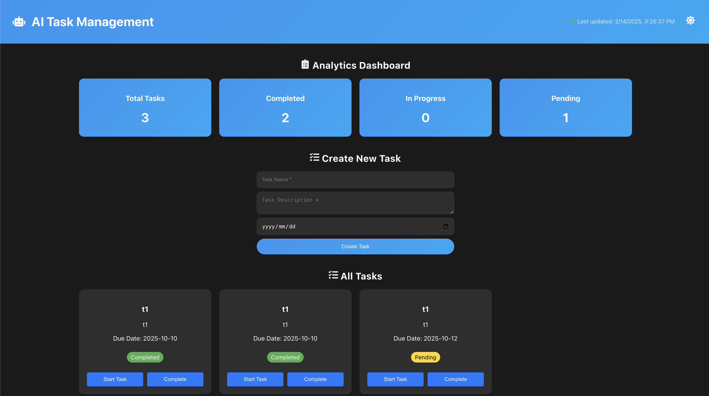

# Task Management App

### Frontend
> Intro
```
Framework : React & React Native 
```

### Backend
> Intro
```
Framework : Flask
```

### Database
> SQLite
```
Path : ./taskmanagement-api/instance/tasks.db
```

## Display
> Web
```

```